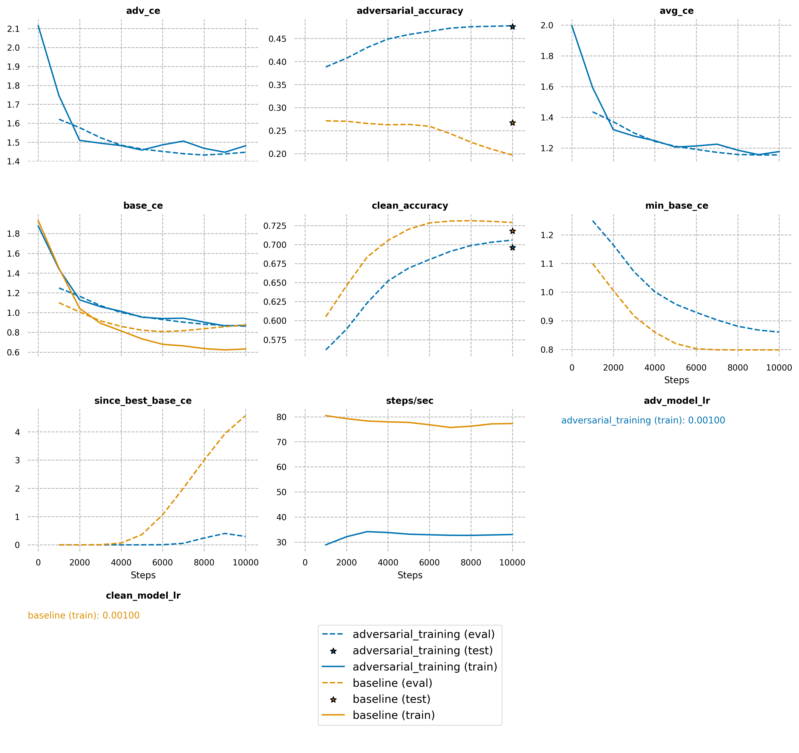

# Adversarial Training
This repository is a implementation of FGSM attack adversarial training proposed by paper [Explaining and Harnessing Adversarial Examples](https://arxiv.org/abs/1412.6572).


## Prerequisites:
* Python >= 3.6
* TensorFlow >= 2.3.0
* PyTorch >= 1.6.0
* [FastEstimator](https://github.com/fastestimator/fastestimator) == 1.1.1


## Running the code
```
cd source
python baseline.py
python adversarial_training.py
```

## Training log
The training log is stored in `logs` folder

## Result

result is generated by the following command:

```
fastestimator logs ./logs/
```

